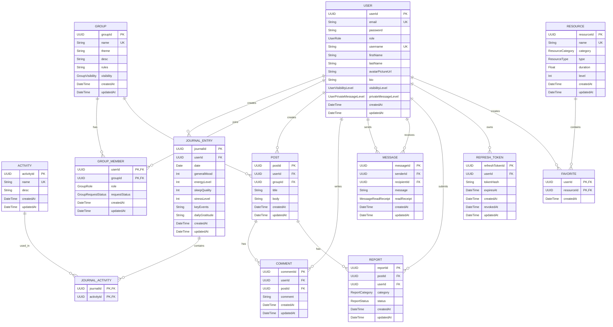

# MindHarbor-Hackathon

## Technical Requirements

- TypeScript (Whole project in TS with strict mode activated)
- Neon PostgreSQL (for the DB)
- Prisma (for DB connection)
- Express (for routes)
- JWT Auth
- Axios (for internal API)
- React (for frontend ui)
- Git (for version control)

## Installation

**Clone the repo**
```bash
git https://github.com/Kkiriya/MindHarbor-Hackathon
cd MindHarbor-Hackathon
```

**Install dependencies**
```bash
npm install
```

**Set up the environment variables**
use the .env.example to set them up

**Generate prisma Client**
```bash
npx prisma generate
```

**Set up the database**
```bash
npx prisma deploy
```

**For demo, Seed the db**
```bash
npm run seed
```
**launch the backend server**
```bash
cd server
npm run dev
```

**launch the frontend server**
```
cd client
npm run dev
```

## Variables d'environment

.env (server)

```.env
DATABASE_URL="url de la connexion NEON"
DEVELOPMENT_DATABASE_URL="url de la connexion NEON, branche dev"
JWT_ACCESS_SECRET="secret_JWT"
JWT_REFRESH_SECRET="secret_JWT"
ACCESS_TOKEN_TTL="temps avant expiration du token"
REFRESH_TOKEN_TTL="temps avant expiration du token"
PORT="Port sur lequel le serveur s'execute"
CLIENT_URL="url pour le client"
```

.env (client)

```.env
VITE_API_URL="url pour l'api"
DATABASE_URL="url pour la base de donnees"
```

## Commandes

commandes (server)

```bash
# Lancer le seed
npm run seed

# Lancer le server
npm run dev
```

commandes (client)

```bash
# Lancer le server
npm run dev
```

## Comptes de démonstration

| Rôle           | Courriel                        | Mot de passe | Particularité                   |
| -------------- | ------------------------------- | ------------ | ------------------------------- |
| Administrateur | admin@mindharbor.com            | adminPswd    | Compte admin                    |
| Modérateur     | thomas.gagnon@mindharbor.local  | User123      | modère le groupe <anxietyGroup> |
| Utilisateur    | sophie.martin@mindharbor.local  | User123      | 30 jours de journal             |
| Utilisateur    | lucas.tremblay@mindharbor.local | User123      | profil privé                    |

## Points d'acces API

**implémenter et fonctionel**

**Authentification**
| Method | Route | Access |
| ------ | ----- | ------ |
| POST | /api/v1/auth/register | Public |
| POST | /api/v1/auth/login | Public |
| POST | /api/v1/auth/refresh | Public, jeton valide |
| POST | /api/v1/auth/logout | Authentifié |
| GET | /api/v1/auth/me | Authentifié |

**Journal et tendances**
| Method | Route | Access |
| ------ | ----- | ------ |
| GET | /api/v1/journal (iste paginée de mes entrées) | Auteur seulement |
| POST | /api/v1/journal (entrée du jour) | Auteur seulement | Auteur seulement |
| GET | /api/v1/journal/:date | Auteur seulement |
| PATCH | /api/v1/journal/:date (jusqu’à minuit) | Auteur seulement |
| GET | /api/v1/journal/stats?range=30d | Auteur seulement |
| GET | /api/v1/journal/insights | Auteur seulement |

## Diagramme ERD



Nous avons décidé de prendre en compte toutes les **core features** lors de la conception de la base de données afin de faciliter toute intégration supplémentaire que nous souhaiterions faire.

**User**
Cette table contient toutes les informations liées à un utilisateur, soit son mot de passe, son nom d'utilisateur, son courriel, son rôle, etc.

**Journal_Entry**
Cette table contient toutes les informations nécessaires à la création d'une entrée de journal. Elle est également reliée à la table **Activity** par une table de jonction **Journal_Activity**. Cette table de jonction est nécessaire puisque les activités sont universelles et peuvent être reliées à plusieurs journaux en même temps, tandis qu'un journal peut également contenir plusieurs activités.

**Activity**
Cette table contient toutes les informations nécessaires pour définir une activité.

**Group**
Cette table contient toutes les informations nécessaires à la conception d'un groupe. Elle est reliée à la table **User** par une table de jonction **Group_member**. Cette table de jonction est nécessaire puisqu'un utilisateur peut appartenir à plusieurs groupes en même temps et qu'un groupe peut avoir plusieurs utilisateurs en même temps.

**Post**
Cette table contient toutes les informations nécessaires à la conception d'un post.

**Comment**
Cette table contient toutes les informations nécessaires à la conception d'un commentaire.

**Message**
Cette table contient toutes les informations nécessaires à la conception d'un message.

**Report**
Cette table contient toutes les informations nécessaires à la conception d'un signalement.

**RefreshToken**
Cette table contient les refresh tokens hachés de chaque utilisateur.

**Ressource**
Cette table contient toutes les informations nécessaires à la conception d'une ressource. Elle est reliée à la table **User** par une table de jonction **Favorite**. Cette table de jonction est nécessaire puisqu'une ressource peut exister indépendamment d'un utilisateur, qu'un utilisateur peut avoir plusieurs ressources dans ses favoris et qu'une même ressource peut être ajoutée aux favoris par plusieurs utilisateurs différents.
